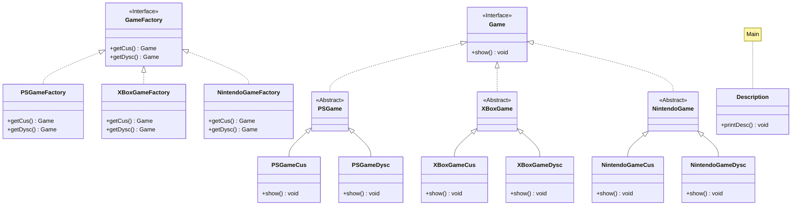

```mermaid
    classDiagram
        class GameFactory{
            <<Interface>>
            +getCus() Game
            +getDysc() Game
        }

        class PSGameFactory{
            +getCus() Game
            +getDysc() Game
        }

        class XBoxGameFactory{
            +getCus() Game
            +getDysc() Game
        }

        class NintendoGameFactory{
            +getCus() Game
            +getDysc() Game
        }

        class Game{
            <<Interface>>
            +show() void
        }

        class PSGame{
            <<Abstract>>
        }

        class XBoxGame{
            <<Abstract>>
        }

        class NintendoGame{
            <<Abstract>>
        }

        class PSGameCus{
            +show() void
        }

        class PSGameDysc{
            +show() void
        }

        class XBoxGameCus{
            +show() void
        }

        class XBoxGameDysc{
            +show() void
        }

        class NintendoGameCus{
            +show() void
        }

        class NintendoGameDysc{
            +show() void
        }

        class Description{
            +printDesc() void
        }

        GameFactory <|.. PSGameFactory
        GameFactory <|.. XBoxGameFactory
        GameFactory <|.. NintendoGameFactory

        Game <|.. PSGame
        Game <|.. XBoxGame
        Game <|.. NintendoGame

        PSGame <|-- PSGameCus
        PSGame <|-- PSGameDysc

        XBoxGame <|-- XBoxGameCus
        XBoxGame <|-- XBoxGameDysc

        NintendoGame <|-- NintendoGameCus
        NintendoGame <|-- NintendoGameDysc

        note for Description "Main"
```